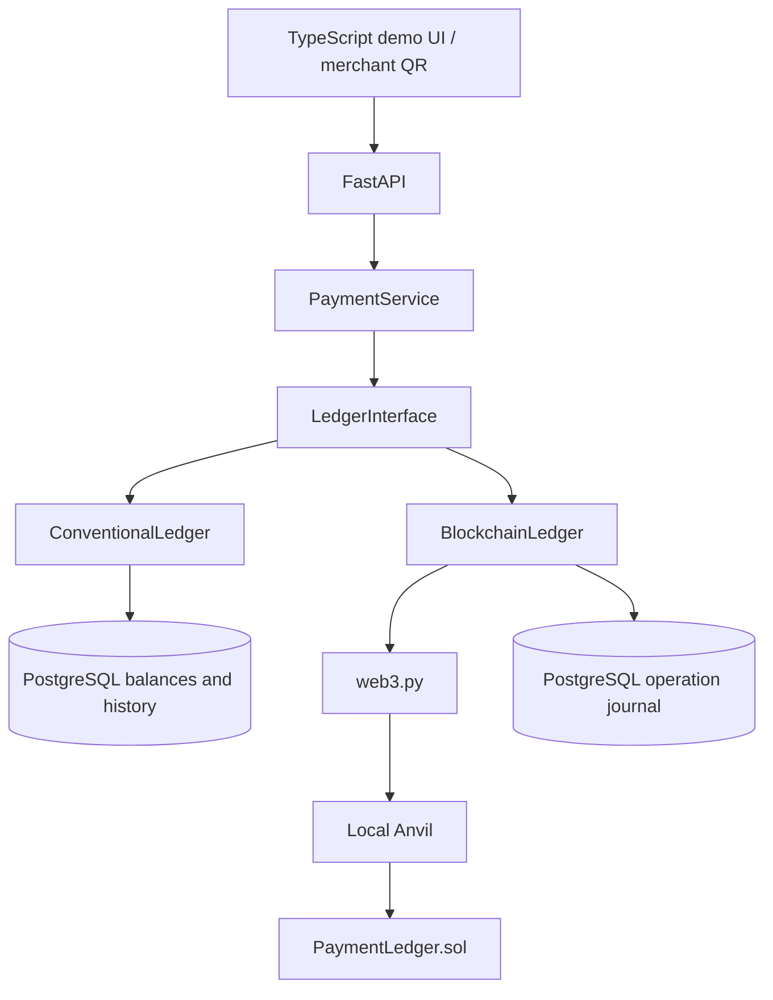

# Engineering report: one payment, two ledgers

## 1. Problem Statement

A small instant-payment network needs a correct, explainable transfer before a ledger technology can be compared. The experiment asks whether adding a blockchain ledger offers a meaningful advantage over a conventional transactional ledger in this deliberately narrow setting. The [roadmap](UPI_PAYMENT_INTERVIEW_ROADMAP.md) and [architecture record](ARCHITECTURE_AND_DECISIONS.md) define the original scope.

## 2. Scope

One test-user, QR-initiated payment flow, two interchangeable ledger adapters, and one controlled local comparison. The interview fixture is `C001 = 100000 öre` (1000 SEK), `M001 = 0 öre`, followed by a `10000 öre` (100 SEK) payment and `SUCCESS` with balances `90000/10000 öre`. Synthetic data and local Anvil only; no real money, bank integration, public blockchain, or production custody. C08's measured workload uses **1000 öre (10 SEK) per payment**, not the interview fixture's 100 SEK; the logical rules are the same but the scenarios must not be conflated. [Demo runbook](DEMO_RUNBOOK.md), [C08 artifacts](evidence/benchmarks/).

## 3. Research Question

> Does a blockchain-based ledger provide meaningful advantages over a conventional transactional ledger for a small UPI-inspired instant-payment network?

“Meaningful” is evaluated with measured local correctness and performance, plus separately identified architectural trade-offs—not with a presumption that either technology must win.

## 4. System Architecture

The UI and API select a ledger; `PaymentService` creates a canonical payment fingerprint and invokes the ledger-neutral protocol. This prevents a second application/business flow from being built for blockchain and makes a same-logical-workload comparison possible. The blockchain adapter's PostgreSQL journal coordinates idempotency and uncertain submission outcomes; the deployed contract, not that journal, owns blockchain balances. [Implementation: service](src/upi_payment_experiment/payment_service.py), [interface](src/upi_payment_experiment/ledger.py), [demo factory](src/upi_payment_experiment/demo_app.py).

## 5. Technology Decisions

Python/FastAPI supplies the shared HTTP/application boundary. PostgreSQL supplies an ACID transfer baseline. A plain TypeScript/HTML/CSS UI compiled with `tsc` is a thin same-origin presentation layer; no framework or independent frontend server is needed. A minimal Solidity contract on **local Anvil**, called through web3.py, makes EVM transaction/receipt behavior observable without turning the study into public-chain infrastructure. Integer öre keeps financial arithmetic out of binary floating point. [Architecture record](ARCHITECTURE_AND_DECISIONS.md), [Python dependencies](pyproject.toml), [frontend build](package.json), [contract](contracts/PaymentLedger.sol).

## 6. Alternatives Considered

The conventional ledger was built first to establish a transactional correctness baseline before testing whether blockchain changes the trade-off. A duplicated blockchain-specific application path was rejected in favor of `LedgerInterface`. A larger frontend framework was unnecessary for the fixed demo. Public-chain deployment, real banking integration, and production key custody were excluded by scope, so their properties are not claimed here. These are project decisions, not measured evidence that the alternatives are universally inferior. [Architecture decisions](ARCHITECTURE_AND_DECISIONS.md), [roadmap](UPI_PAYMENT_INTERVIEW_ROADMAP.md).

## 7. Payment Correctness and Safety

The backend validates positive integer-minor-unit amounts, identities, and currency; a canonical fingerprint links the immutable request to idempotency/replay handling. The service rejects payer=merchant. The conventional adapter locks relevant rows, checks funds, writes balances/payment/history/idempotency in one transaction, and rolls back on failure. The blockchain path uses signed transactions, contract checks, a durable operation journal, and receipt reconciliation; ambiguous outcomes are not turned into a fresh retry. QR generation identifies `M001` but does not authorize or execute payment; the UI does not own correctness. Tests cover failure, replay, rollback, and ledger-specific recovery behavior. C08's normalized differential check passed for the measured paired workload. [Payment service](src/upi_payment_experiment/payment_service.py), [conventional adapter](src/upi_payment_experiment/conventional_ledger.py), [blockchain adapter](src/upi_payment_experiment/blockchain_ledger.py), [C03–C08 evidence](PAYMENT_CARD_EVIDENCE_MAP.md).

## 8. Conventional Ledger

`ConventionalLedger` stores account balances and linked payment/transaction records in PostgreSQL. A successful database **COMMIT** is its operational benchmark completion point. Its database transaction is the transfer's atomicity boundary: a mid-transfer failure must not leave a payer debit without the matching merchant credit. Its trust and administration model is the application plus database operator, not a decentralized network. [Adapter](src/upi_payment_experiment/conventional_ledger.py), [schema](src/upi_payment_experiment/postgres_schema.sql), [benchmark plan](BENCHMARK_AND_EXPERIMENT_PLAN.md).

## 9. Blockchain Ledger

`BlockchainLedger` signs a payer transaction, submits it through web3.py to the locally deployed `PaymentLedger` contract, and interprets a successful receipt. A PostgreSQL operation journal persists request identity and submission/reconciliation state; it is not the balance authority and does not make the journal and chain one ACID transaction. A successful **local Anvil receipt** is this path's operational benchmark completion point. The test deployment has an admin that registers/seeds participant identities and backend-held local test signing keys. The UI exposes the transaction hash and history, not receipt/gas details; those can be inspected separately from Anvil. [Adapter](src/upi_payment_experiment/blockchain_ledger.py), [journal](src/upi_payment_experiment/blockchain_journal.py), [contract](contracts/PaymentLedger.sol), [bootstrap](src/upi_payment_experiment/blockchain_bootstrap.py).

## 10. Benchmark Methodology

Both paths used the same shared service, deterministic **20 customers and 5 merchants**, equivalent initial balances (1000 SEK per customer, zero per merchant), logical ordering, **10 SEK** payment amount, and one benchmark implementation. Primary runs were **sequential**, with workload sizes **10, 100, 500, 1000** and **five measured runs per size per ledger**. State was reset and verified before each measured run; three warm-up payments per workload were excluded. Setup, reset, and verification were outside the measured interval. Primary ledger-only timing ends at PostgreSQL commit or successful local-Anvil receipt, respectively. Secondary in-process ASGI API timing is distinct from the UI's browser-observed request time. Throughput is completed attempts divided by measured run duration, summarized across runs. These completion points are not equivalent settlement, durability, or production-fault-tolerance guarantees. [Canonical plan](BENCHMARK_AND_EXPERIMENT_PLAN.md), [conventional data](evidence/benchmarks/conventional/benchmark_results.json), [blockchain data](evidence/benchmarks/blockchain/benchmark_results.json).

## 11. Benchmark Results

All numbers below are the recorded C08 **ledger-only** aggregates (milliseconds) and mean measured-run throughput (payments/second), rounded to three decimals. They are not the 100 SEK live-demo timings.

| Workload | Ledger | Average ms | Median ms | p95 ms | Throughput payments/s |
|---:|---|---:|---:|---:|---:|
| 10 | PostgreSQL | 7.841 | 5.680 | 16.385 | 126.048 |
| 10 | Local Anvil | 92.436 | 100.255 | 108.451 | 10.228 |
| 100 | PostgreSQL | 5.976 | 5.704 | 7.413 | 139.877 |
| 100 | Local Anvil | 92.656 | 100.234 | 113.104 | 10.178 |
| 500 | PostgreSQL | 6.095 | 5.846 | 7.659 | 134.406 |
| 500 | Local Anvil | 94.683 | 101.987 | 113.146 | 9.957 |
| 1000 | PostgreSQL | 6.399 | 6.034 | 8.056 | 130.429 |
| 1000 | Local Anvil | 97.084 | 102.964 | 112.550 | 9.725 |

The C08 artifacts contain **40 valid measured runs**, **8050 successful measured payments per ledger (16100 total)**, **zero payment failures**, and **zero invalid runs**. At workload 1000, mean in-process API end-to-end latency was **7.630 ms** (conventional) and **98.358 ms** (blockchain). Blockchain mean submission latency ranged **32.854–35.169 ms** and mean confirmation latency **50.650–54.464 ms** across workloads. Recorded successful-transaction mean gas used was **73559.72**, **65864.072**, **65180.3312**, and **65094.7448** for the four workload sizes; the failed/reverted gas population was **zero**, so no failed-gas average exists. Gas is local execution evidence, not a monetary-cost estimate. [Per-ledger JSON and raw records](evidence/benchmarks/), [timing definitions](BENCHMARK_AND_EXPERIMENT_PLAN.md).

## 12. Differential Correctness Results

The normalized comparison reports **PASS** for **20 paired contexts**, **zero mismatches**, and **zero invalid paired contexts**. It compares shared business outcomes—payment status, balance deltas/conservation, history linkage, and replay behavior—while excluding implementation-specific hashes, receipt/event identity, gas, and timing. That supports equivalence of required logical outcomes for this dataset and sequence, not identical operational guarantees. [Differential artifact](evidence/benchmarks/differential_results.json), [comparison boundary](evidence/benchmarks/qualitative_comparison.md).

## 13. Conventional vs Blockchain Comparison

| Dimension | PostgreSQL path | Local-Anvil path |
|---|---|---|
| Measured primary completion | Successful database commit | Successful local transaction receipt |
| Measured local performance | Lower latency, higher throughput in every C08 workload | Higher latency, lower throughput in every C08 workload |
| Balance authority | PostgreSQL transaction/state | Deployed `PaymentLedger` contract/state |
| Operational evidence | Payment/transaction rows and commit outcome | Transaction hash, receipt, gas, contract event/state plus off-chain journal |
| Trust/operation | Application and database administration | Local chain, contract/deployment admin, RPC, signer keys, plus journal/database administration |

The speed finding is measured; the trust, auditability, and maintenance distinctions are architectural analysis. Neither row implies a universal technology winner. [Measured data](evidence/benchmarks/), [qualitative analysis](evidence/benchmarks/qualitative_comparison.md).

## 14. Operational, Trust, and Security Trade-offs

The PostgreSQL path concentrates operational control in the database and service. The blockchain path adds contract build/deployment, chain/RPC operation, signing keys, nonces, receipt interpretation, and journal/chain reconciliation. Its local contract records processed-payment state and events, but the deployment admin can set up participants, Anvil is one development process, and the PostgreSQL journal remains mutable infrastructure. Contract data visible to a chain/RPC observer is not made private merely by hashing fixture identifiers. Neither implementation has production authentication, custody, KYC/AML, or settlement controls. Cost is assessed qualitatively here; **no public-chain fees or monetary infrastructure costs were measured or estimated**. [Qualitative comparison](evidence/benchmarks/qualitative_comparison.md), [architecture record](ARCHITECTURE_AND_DECISIONS.md).

## 15. Limitations

The workload is synthetic, local, sequential, and single-host, with five runs per workload—not a statistical study of a production payment network. Anvil results do not represent Ethereum mainnet latency, congestion, gas prices, validator finality, decentralization, or public-chain scalability. PostgreSQL commit and Anvil receipt are intentionally different completion boundaries. Concurrency, distributed failure, multi-node consensus, and actual monetary cost were not measured. The live UI's request timer is a presentation observation, not the canonical benchmark. [Benchmark plan](BENCHMARK_AND_EXPERIMENT_PLAN.md), [qualitative comparison](evidence/benchmarks/qualitative_comparison.md).

## 16. Interpretation

For this small controlled experiment, **both ledgers preserved the required logical payment behavior**, and the conventional path was materially faster at its measured completion boundary. Blockchain provided distinct signed-transaction, receipt, gas, and contract-state semantics, alongside additional key-management and operational complexity. Whether those properties justify that complexity depends on an actual trust/governance requirement not demonstrated by this local prototype. The evidence supports this bounded conclusion, not a blanket assertion that blockchain is either good or bad for payments.

## 17. Future Work

If a separate research scope were ever authorized, concurrency, adverse network conditions, public-chain economics, and governance/correction requirements would need their own methodology and evidence before broader claims. These are **possible studies only**, not implemented features, approved next Cards, or a change to this experiment's architecture. [Project control](PROJECT_CONTROL.md).

## 18. Evidence References

- [README](README.md) and [demo runbook](DEMO_RUNBOOK.md): reproducible local setup and interview flow.
- [Architecture and decisions](ARCHITECTURE_AND_DECISIONS.md), [roadmap](UPI_PAYMENT_INTERVIEW_ROADMAP.md), and [Card evidence map](PAYMENT_CARD_EVIDENCE_MAP.md): requirements, decisions, implementation, and verification traceability.
- [Benchmark and experiment plan](BENCHMARK_AND_EXPERIMENT_PLAN.md): canonical workload, fairness, timing, and interpretation rules.
- [Conventional aggregates](evidence/benchmarks/conventional/benchmark_results.json), [blockchain aggregates](evidence/benchmarks/blockchain/benchmark_results.json), and [differential result](evidence/benchmarks/differential_results.json): quoted quantitative facts.
- [Conventional raw measurements](evidence/benchmarks/conventional/per_transaction_results.jsonl), [blockchain raw measurements](evidence/benchmarks/blockchain/per_transaction_results.jsonl), and [qualitative comparison](evidence/benchmarks/qualitative_comparison.md): transaction-level and non-numeric evidence.
